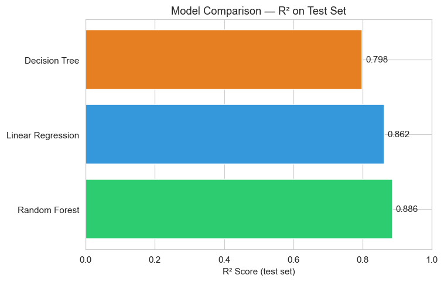
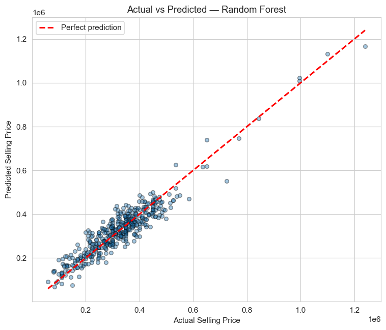
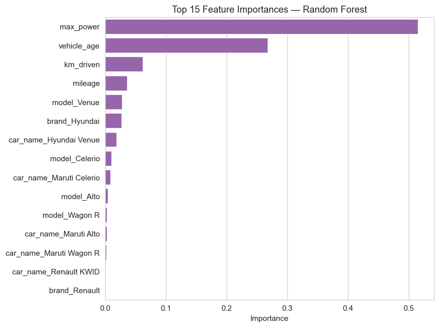
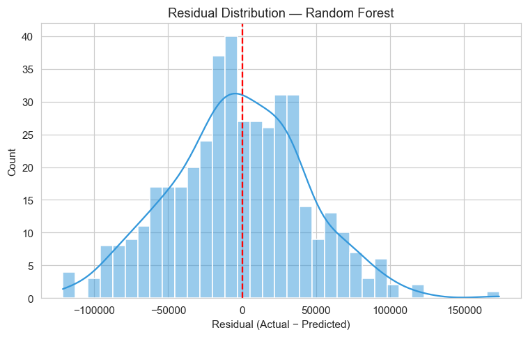

# 🚗 Car Price Prediction — Machine Learning

An end-to-end machine learning project that predicts used car selling prices using **Linear Regression, Decision Tree, and Random Forest**, with 5-fold cross-validation and GridSearchCV hyperparameter tuning.

## 📌 Problem Statement

Used-car pricing is inconsistent and subjective. This project builds a regression model that estimates a fair selling price from vehicle attributes, enabling data-driven pricing decisions for dealers and buyers.

## 📊 Dataset

- **Rows:** 2,119
- **Features:** `car_name`, `brand`, `model`, `vehicle_age`, `km_driven`, `mileage`, `max_power`, `seats`
- **Target:** `selling_price`
- **Source file:** `car_data.csv` (bundled in repo)

## 🔬 Workflow

1. Data loading and inspection (`df.info()`, `df.shape`)
2. Train/test split — 80/20, `random_state=42`
3. Preprocessing pipeline with `ColumnTransformer`:
   - One-Hot Encoding for `car_name`, `brand`, `model`
   - Passthrough for numerical features
4. Model training inside `Pipeline`:
   - Linear Regression
   - Decision Tree Regressor
   - Random Forest Regressor
5. 5-fold Cross-Validation (`scoring=r2`)
6. Hyperparameter tuning with `GridSearchCV` for Decision Tree and Random Forest
7. Evaluation on held-out test set: MAE, MSE, RMSE, R²

## 📈 Results

| Model | MAE | RMSE | R² | 5-fold CV R² |
|-------|-----|------|-----|--------------|
| **Random Forest** | **36,052.38** | **45,594.40** | **0.8857** | **0.8853** |
| Linear Regression | 38,110.00 | 50,165.69 | 0.8616 | 0.8726 |
| Decision Tree | 45,751.57 | 60,584.48 | 0.7981 | 0.8270 |

**Best model:** Random Forest Regressor (untuned pipeline scored highest on both test R² and CV R²).

**Tuned Decision Tree (GridSearchCV):**
- `max_depth = 10`
- `min_samples_leaf = 4`
- `min_samples_split = 10`
- **Best CV R² = 0.8913**

## 📊 Visualizations

### Model Comparison (R²)


### Actual vs Predicted Prices


### Feature Importance (Top 15)


### Residual Distribution


## 📁 Project Structure

```
car-price-prediction-machine-learning/
├── capstone project.ipynb   # Main notebook (EDA → training → tuning → evaluation)
├── car_data.csv             # Dataset (2,119 rows)
├── requirements.txt
├── .gitignore
└── README.md
```

## 🚀 How to Run

```bash
git clone https://github.com/ojwangmaxwell3-ux/car-price-prediction-machine-learning.git
cd car-price-prediction-machine-learning
pip install -r requirements.txt
jupyter notebook
```

Open `capstone project.ipynb` and run all cells.

## 🛠️ Tech Stack

Python · Pandas · NumPy · Scikit-learn · Matplotlib · Seaborn · Jupyter

## 👤 Author

**Maxwell Odhiambo**

- GitHub: [@ojwangmaxwell3-ux](https://github.com/ojwangmaxwell3-ux)
